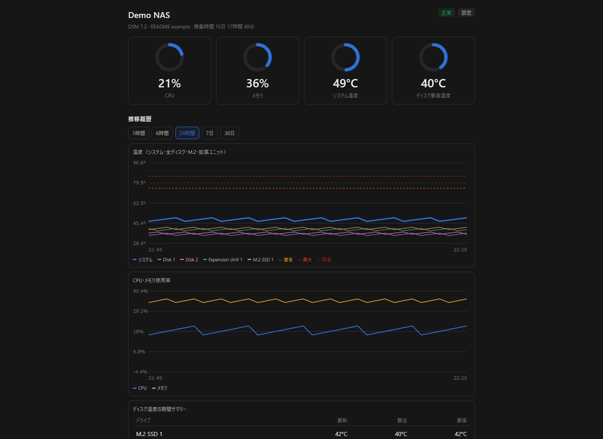
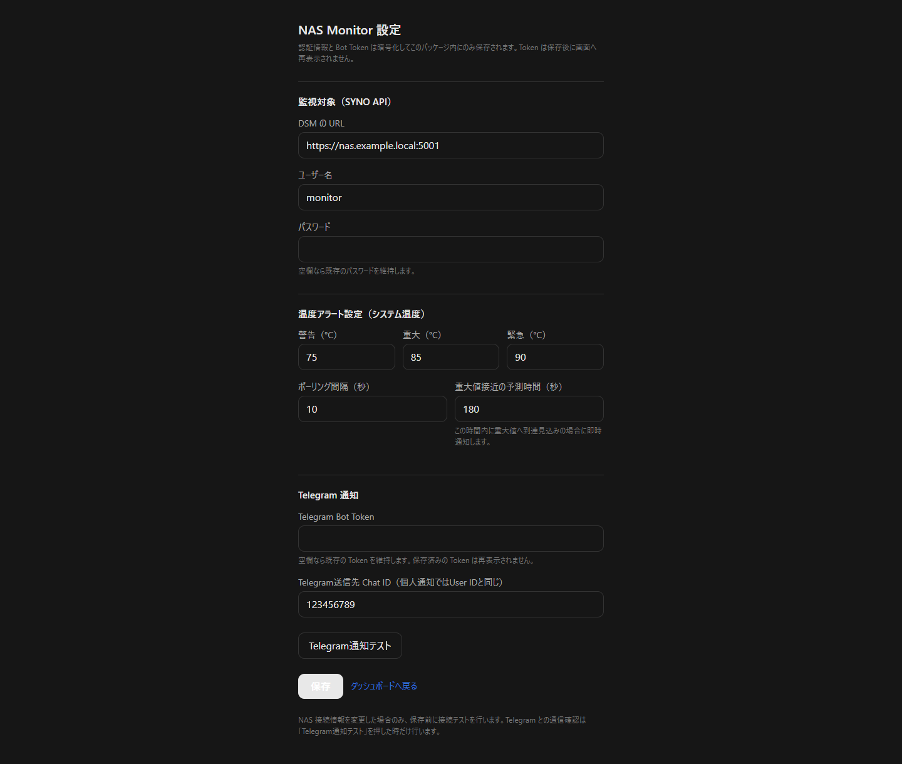
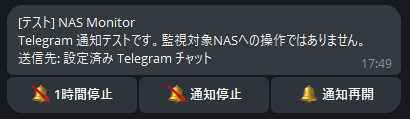
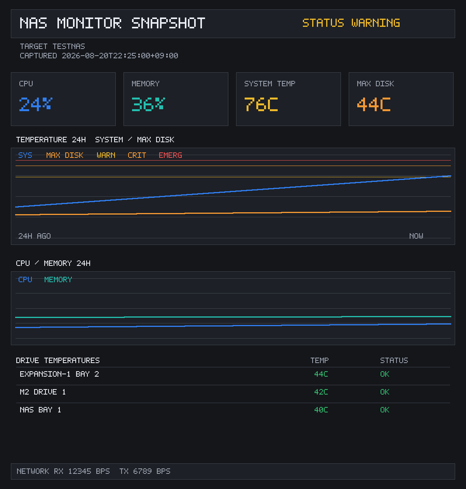

# NAS Monitor for Synology DSM

SYNO.API を使い、別の Synology NAS の状態をブラウザ画面と Telegram で監視する DSM 7 向けパッケージです。


## 画面イメージ

以下は、実際の画面構成を汎用データで表示した例です。NAS名、URL、アカウント、温度履歴は実機の値を含みません。

### ダッシュボード



### 設定



### Telegram通知と操作ボタン



### Telegram向け状況画像



## 主な機能

- システム温度、CPU、メモリ、ネットワーク使用量
- 内蔵ディスク、拡張ユニット、M.2 SSD の温度と状態
- 温度の Warning / Critical / Emergency 通知と、復旧通知
- Telegram 通知、1時間停止、通知停止、通知再開、状況画像取得
- 自動Telegram通知には、現在値・24時間推移・全ドライブ温度を収めた一枚の状況画像を添付
- ポーリングごとの時系列履歴を最大30日保存
  - CPU、メモリ、システム温度、全ディスク温度
  - 1時間、6時間、24時間、7日、30日のグラフ表示
  - グラフ上にマウスを乗せると、その時点の日時と各系列の値を表示
  - ディスクごとの最新値・最低値・最高値
- 数値一覧（最新60件）
  - 日時（秒まで）、CPU、メモリ、システム温度、各ディスク温度を一覧表示
  - 表の内部スクロール、列見出しタップによる並べ替えに対応
  - 初期表示とCSV出力は常に日時の新しい順
- CSV出力
  - 最新60件を、日時の降順で出力
  - Excelで開きやすいUTF-8 BOM／CRLF形式
  - ファイル名に出力時刻を含めます
- パッケージ内蔵 HTTPS サーバー（平文 HTTP は起動しません）
- DSM パッケージセンターの「開く」と DSM デスクトップのランチャー

## 動作条件

- 監視サーバー: DSM 7.x
- 監視対象: SYNO.API にログイン可能な Synology NAS
- パッケージ内蔵 Web UI: TCP 8811 / HTTPS
- Telegram を使う場合: Bot Token と送信先 Chat ID

## 監視用 DSM アカウント

このパッケージは、監視対象 NAS のシステム情報とストレージ情報を SYNO.API で読み取ります。

1. 監視対象 NAS で、専用の DSM ユーザーを作成します。
2. そのユーザーを `administrators` グループへ追加します。
3. **共有フォルダへの権限はすべて「アクセスなし」にしてください。**
   この監視用途では、共有フォルダの閲覧・書込み権限は必要ありません。
4. この専用アカウントを、通常のファイル操作・DSM管理・外部公開には使用しないでください。

`administrators` への所属は、現行の SYNO.API からシステム／ストレージ状態を取得するために必要です。ただしこのグループは DSM 上で権限を変更できる強い権限です。共有フォルダを「アクセスなし」にしても、機密データを技術的に隔離する保証にはなりません。普段のデータ操作には使わず、NAS Monitor 専用にしてください。

## インストールと設定

1. DSM のパッケージセンターで手動インストールを選び、対応する `.spk` を指定します。
2. インストール後、パッケージセンターの **開く**、または DSM デスクトップの **NAS Monitor** を開きます。
3. 設定画面で次を登録します。
   - 監視対象 NAS の DSM URL
   - 専用の監視用アカウントとパスワード
   - 温度の警告／重大／緊急しきい値
   - Telegram Bot Token と送信先 Chat ID（個人チャットでは User ID と同じ）
4. **Telegram通知テスト** を実行します。

Web UI の URL は次の形式です。

```text
https://<監視サーバーのIPアドレス>:8811/
```

初回アクセスでは自己署名証明書の警告が表示されます。監視サーバーのIPアドレスが正しいことを確認して続行してください。

## Telegram通知の設定と操作

1. Telegram で `@BotFather` を開き、Botを作成して Bot Token を取得します。
2. 作成したBotとの個人チャットを開き、`/start` を送信します。
3. 設定画面に Bot Token と **Telegram送信先 Chat ID** を入力して保存します。個人チャットへ送る場合、このChat IDはUser IDと同じ値です。
4. **Telegram通知テスト** を押し、上図のようなテストメッセージが届くことを確認します。テスト通知は、監視対象NASを操作しません。

届いた通知には、次の操作ボタンが表示されます。

| ボタン | 動作 |
| --- | --- |
| 🔕 1時間停止 | 温度異常・復旧などの**自動Telegram通知だけ**を1時間停止します。1時間後に自動で再開します。 |
| 🔕 通知停止 | 自動Telegram通知を停止します。再開ボタンを押すまで継続します。 |
| 🔔 通知再開 | 自動Telegram通知を直ちに再開し、現在の状態もTelegramへ送信します。 |
| 📷 スクショ取得 | 押した時点でSYNO.APIから最新情報を取得し、現在の状況画像をTelegramへ返信します。 |

自動通知・通知テスト・📷 スクショ取得では、現在値、24時間の温度推移、CPU／メモリ推移、全ドライブ温度を一枚に描いた状況画像を送信します。これはNAS上で生成する軽量な監視レポート画像であり、ブラウザ画面を撮影するためにChrome等を常駐させる方式ではありません。

📷 スクショ取得で最新取得に失敗した場合は、直近の保存データを使い、画像と本文にその事実を明記します。値を推測・補完することはありません。画像の添付自体に失敗した場合だけは、温度異常の見落としを避けるため本文のTelegram通知を優先して送信します。

どの停止状態でも、SYNO.APIによる監視、ポーリング、履歴記録、ダッシュボード更新は継続します。ボタンを押すと、元のTelegramメッセージに現在の通知状態が追記されますが、**すべての操作ボタンは残ります**。そのため、1時間停止・通知停止のあとでも、同じメッセージからいつでも通知再開や状況画像の取得ができます。登録済みのChat ID以外からの操作は受け付けません。

状況画像のドライブ欄は、温度順で表示しますが、取得配列の通し番号は表示しません。物理的な位置を示す `NAS BAY 1`、`DX517-1 BAY 4`、`M2 DRIVE 1` の形式で表記します。

## 更新時の注意

新しい SPK は、既存パッケージをアンインストールせずに手動インストールで更新してください。設定、Telegram情報、HTTPS証明書、通知履歴は引き継がれます。

### v0.5.17 への更新

v0.5.17 では、履歴の時刻を丸めず、監視サーバーが取得した時点の秒まで保存する方式へ変更しました。そのため、初回の v0.5.17 更新時だけ、旧形式の時系列履歴（グラフと数値一覧のデータ）を削除します。監視設定、Telegram情報、HTTPS証明書、通知履歴は削除されません。v0.5.17 以降の通常更新では、保存済みの時系列履歴を引き継ぎます。

### v0.5.18 への更新

自動Telegram通知へ状況画像を追加し、`📷 スクショ取得` ボタンで最新の状況画像を手動取得できるようにしました。設定、Telegram情報、HTTPS証明書、通知履歴、時系列履歴はそのまま引き継がれます。

### v0.5.19 への更新

状況画像のドライブ名を物理ベイ表記へ修正しました。また、通知状態を追記したあともTelegramの操作ボタンを維持するようにしました。既存の設定・履歴はそのまま引き継がれます。

## 時刻について

履歴・数値一覧・CSVの時刻は、監視対象から情報を受け取った際に**監視サーバー側**で記録した時刻です。監視対象NAS自身が返す時刻ではありません。

## セキュリティ上の注意

- Bot Token、DSM パスワードは画面や API に再表示せず、NAS 内の暗号化ファイルに保存します。
- リポジトリ、画面キャプチャ、Issue、ログへ Token やパスワードを書かないでください。
- Web UI（8811番）にはログイン機能がありません。信頼できる LAN 内だけで使用し、必要なネットワーク範囲だけに許可してください。インターネットへ公開する用途は想定していません。
- 監視対象NASへの SYNO.API 接続は、自己署名証明書を使う環境に対応するため証明書検証を省略しています。信頼できる LAN 内で使用してください。

## ソースからのビルド

Python 3 と Pillow が必要です。

```bash
python -m pip install Pillow
python test_alerts.py
python build.py
```

生成物は `dist/nasmon-<version>.spk` です。

## ライセンス

[MIT License](LICENSE) です。

## 免責

本ソフトウェアは個人利用を想定した監視補助ツールです。温度異常、データ損失、ハードウェア故障を完全に防止するものではありません。重要データは別途バックアップしてください。
